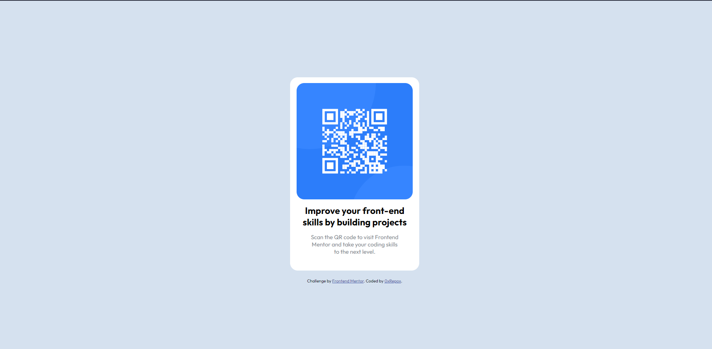

# 0xRepox - QR code component solution

This is a solution to the [QR code component challenge on Frontend Mentor](https://www.frontendmentor.io/challenges/qr-code-component-iux_sIO_H). Frontend Mentor challenges help you improve your coding skills by building realistic projects. 

## Table of contents

- [Overview]i(#overvew)
  - [Screenshot](#screenshot)
  - [Links](#links)
- [My proces]
  - [Built with](#built-with)
  - [What I learned](#what-i-learned)
  - [Continued development](#continued-development)
- [Author](#author)
- [Acknowledgments](#acknowledgments)

**Note: Delete this note and update the table of contents based on what sections you keep.**

## Overview

### Screenshot

### Links

- Solution URL: [Add solution URL here](https://your-solution-url.com)
- Live Site URL: [Add live site URL here](https://your-live-site-url.com)

### Built with

- Semantic HTML5 markup
- CSS custom properties
- CSS Grid
- [Styled Components](https://styled-components.com/) - For styles

### What I learned

This is my first HTML challenge and project, I am super glad I could replicate the desktop version.

### Continued development

Doing this, I am motivated at the behinning of my roadmap into becoming a Blockchain website developer.

### Useful resources

## Author

- Website - [Add your name here](https://www.your-site.com)
- Frontend Mentor - [@0xRepox](https://www.frontendmentor.io/profile/0xRepox)
- Twitter - [@0xRepox](https://www.twitter.com/0xRepox)

## Acknowledgments

Thanks to Angela Yu, for guiding me on the journey.

